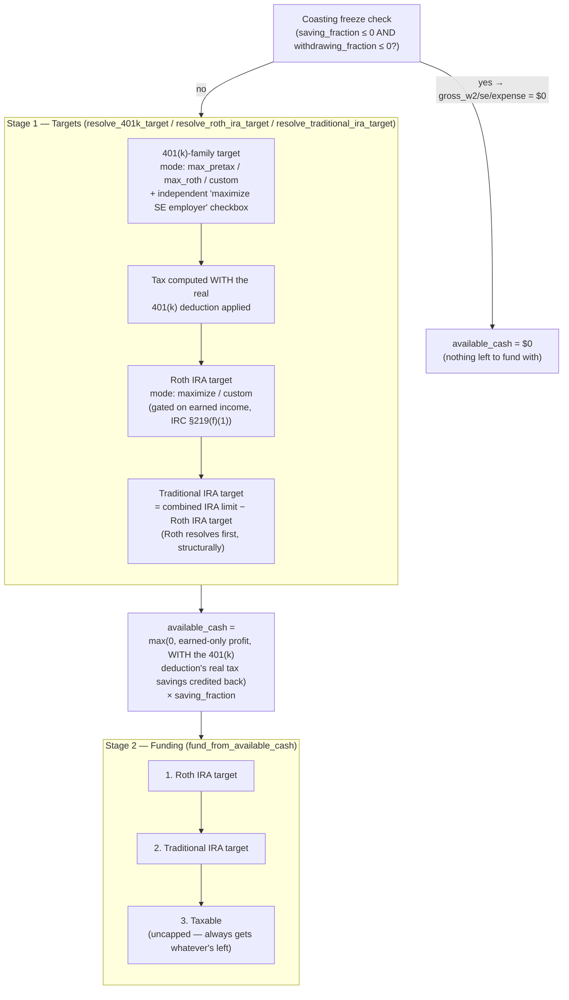

# How contributions work today — 1 pager

**As of:** 2026-08-22, after `CONTRIBUTION_TOGGLE_REDESIGN.md` shipped in full. This replaces the
old priority-order waterfall (six destinations racing for one shared `investable` pool, described in
this file's prior revision) with a per-destination **mode/toggle system**. There is no more waterfall,
no more `use_contribution_waterfall` toggle, and no more "manual override" concept — every year,
every destination, always resolves the same way, in two stages.

## The two stages, one year at a time

**The critical asymmetry, preserved from the redesign doc's own §1:** the 401(k) family is **not**
part of Stage 2 at all. It's a payroll deduction — it funds up to its own legal ceiling directly in
Stage 1, every year, regardless of how much liquid cash is actually available. Tax is computed *with*
that real deduction applied, and only *then* does `available_cash` get sized — crediting back the
401(k)'s own real tax savings — for Roth IRA, Traditional IRA, and Taxable to compete over in Stage 2.
A year with plenty of 401(k) room but near-$0 profit still funds the 401(k) in full; Roth/Traditional/
Taxable are what shrink.

## The coasting-phase freeze (unchanged from the old waterfall's own version)

Between `savings_stop_date` and `withdrawal_start_date`: **no W-2/SE/break income, no expenses, no
contributions of any kind.** `gross_w2`, `gross_se`, `gross_ordinary_break_income`, and
`gross_expense` are all forced to `$0` before anything downstream (tax, Stage 1, Stage 2) ever sees
them, so both targets and `available_cash` naturally come out `$0` too. The portfolio's only growth
mechanism during this window is `roll_forward_portfolio`'s existing, unaffected dividend/interest
reinvestment. The freeze is gated on BOTH `saving_fraction <= 0` AND `withdrawing_fraction <= 0` for
the year, so the transition year (the one `savings_stop_date` falls partway through) still earns/
spends normally at its own day-weighted fraction.

## The destinations

| Destination | Mode field(s) | Capacity comes from | Funded from |
|---|---|---|---|
| 401(k)-family (W-2 + SE employee) | `contribution_401k_mode`: `max_pretax` / `max_roth` / `custom` (+ `contribution_401k_custom_type`: `pretax`/`roth` when custom) | §402(g) statutory ceiling, split across W-2's own compensation-linked capacity then SE-employee overflow | **Stage 1 — payroll deduction, never gated on cash** |
| SE employer 401(k) | `maximize_se_employer_401k` (independent boolean) | SE plan's own statutory employer-contribution formula | **Stage 1 — same as above** |
| Roth IRA | `roth_ira_mode`: `maximize` / `custom` | `min(MAGI phase-out max, combined IRA limit)`; `combined_ira_limit` is `$0` whenever there's no earned income that year (IRC §219(f)(1), structural, not a warning) | **Stage 2, priority 1** |
| Traditional IRA | `traditional_ira_mode`: `maximize` / `custom` | `combined_ira_limit − roth_ira_target` — Roth always resolves first | **Stage 2, priority 2** |
| Taxable | none — always the catch-all | Uncapped | **Stage 2, priority 3 — gets whatever's left of `available_cash`, always** |

A "custom" mode's entered dollar amount is always checked against that year's real legal limit —
clamped, and a warning appended to `row["contribution_warnings"]`, never silently over-funded and
never a one-time snapshot that can go stale (unlike the old "Fill Roth IRA at each year's income-
phased maximum" button, removed in this pass — see `CONTRIBUTION_WATERFALL_BUG.md` for the exact
failure mode that button caused, and why "maximize" as a live-recomputed MODE replaces it instead).

## The bulk "reset" button

"Reset all years to the recommended default (max everything)" (`ui/projection_tab.py`) sets every
year's mode to `RECOMMENDED_CONTRIBUTION_CONFIG` (`max_pretax` 401(k), SE employer maximized, both
IRAs on `maximize`) — a **mode**, recomputed fresh every run against that year's real limits, not a
frozen dollar amount. This is the direct fix for the exact staleness bug the old per-year "Fill Roth
IRA..." button caused (`CONTRIBUTION_WATERFALL_BUG.md`): a mode can never go stale the way a
snapshotted dollar figure can.

## SE solo 401(k)'s one known limitation (pre-existing, unrelated to this redesign)

`compute_taxes` has a single `se_solo_employee_deferral` parameter — no pretax/Roth tax-treatment
split for the SE-employee side of a solo 401(k). `resolve_401k_target` tracks
`se_employee_pretax_target`/`se_employee_roth_target` separately for display clarity, but both are
summed into one dollar figure before the `compute_taxes` call. Flagged, not fixed, in this pass —
out of scope per `CONTRIBUTION_TOGGLE_REDESIGN.md`.

## Migrating an old save

A `contribution_by_year` entry from before this redesign (six raw dollar fields: `w2_401k_
contribution`, `roth_401k_contribution`, `se_401k_employee_contribution`, `se_401k_employer_
contribution`, `roth_ira_contribution`, `traditional_ira_contribution`) is detected by the *absence*
of a `contribution_401k_mode` key and migrated on load (`ui/sidebar.py::_migrate_contribution_entry`,
idempotent — a no-op on an already-new-shape entry). IRA fields migrate exactly. The 401(k)-family
migration is an approximation only when a single year had BOTH nonzero pretax and Roth amounts set
simultaneously (rare in practice — the old UI's own fields made a genuine split unusual): the larger
of the two wins `contribution_401k_custom_type`, and all three employee-side amounts (`w2_pretax +
w2_roth + se_employee`) are summed into one `contribution_401k_custom_amount`. For the common case of
a single nonzero field per year, migration is exact and reproduces the identical dollar amount the
old manual-override path would have funded — verified directly in
`tests/test_projection.py::TestContributionMigrationEquivalence`.
